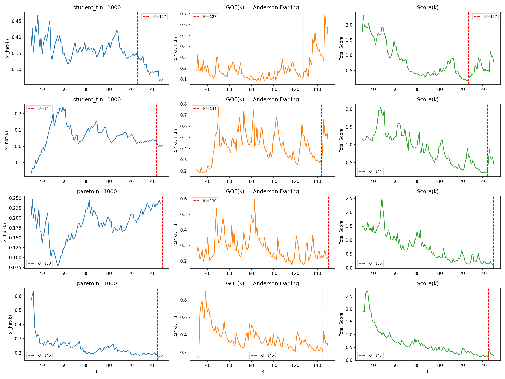
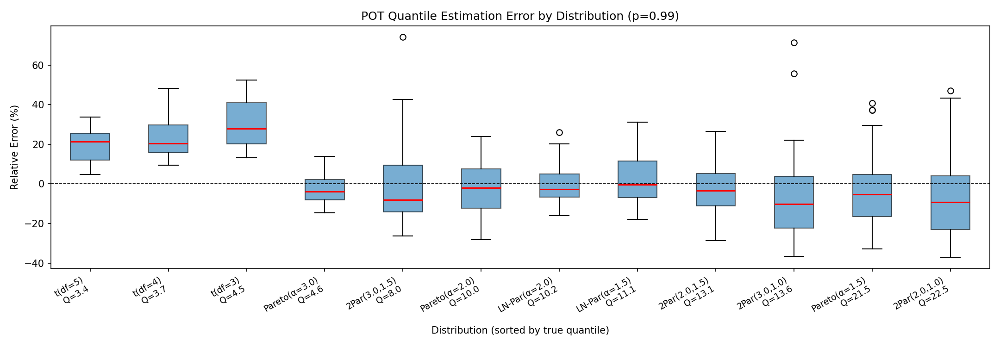
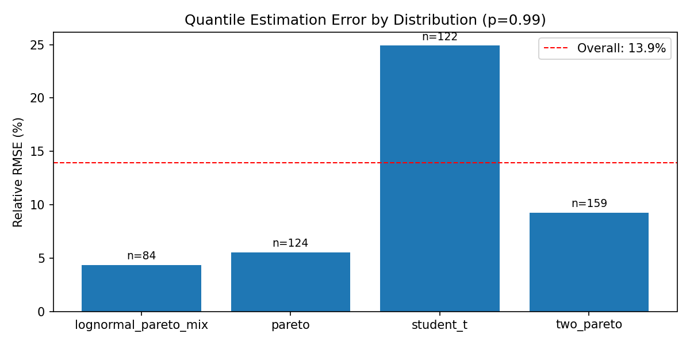
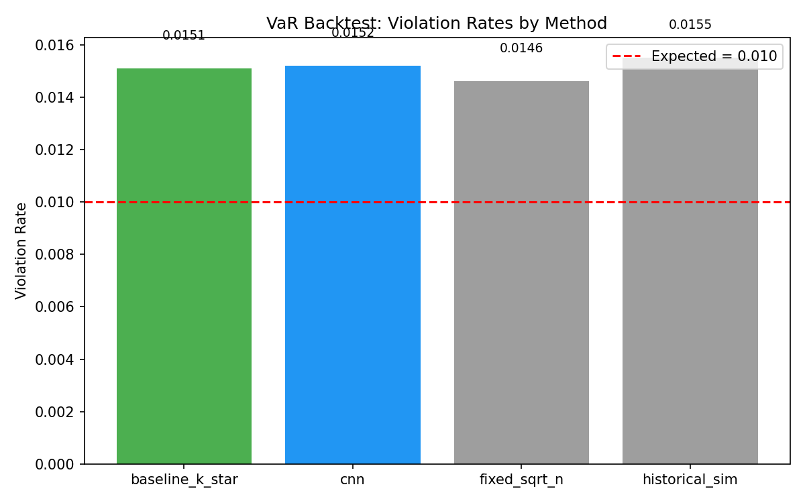
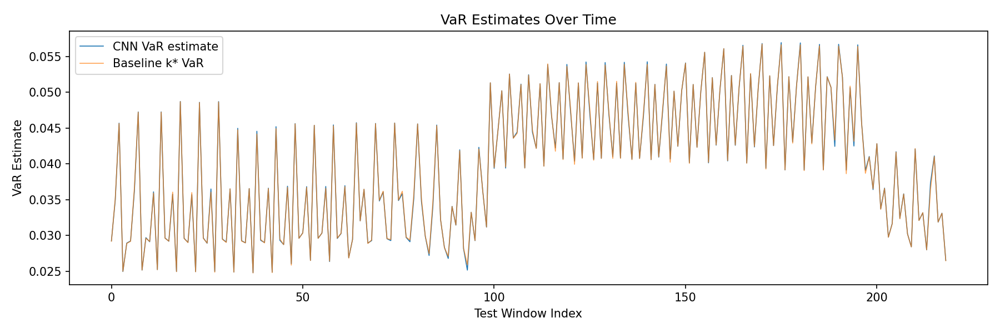
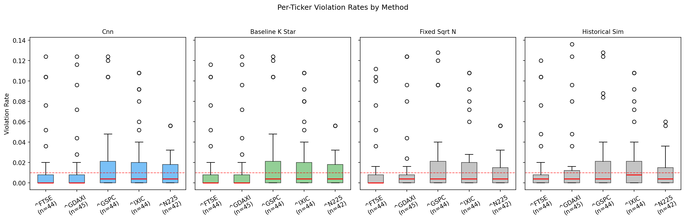

# MasterThesis

ML-Assisted Threshold Selection for Peaks-over-Threshold (POT) with Generalized Pareto Distribution (GPD).

## Overview

Automated method to choose a threshold for POT/GPD fitting using synthetic data with known tail behavior. A baseline scoring rule selects k* (number of exceedances), then a 1D CNN is trained to replicate and generalize that selection from diagnostic features.

## Current Results

### Synthetic Pipeline (Steps 1-7)

The CNN is trained on 7,200 synthetic datasets (4 distribution families, 3 sample sizes, 200 replications each) to predict the optimal number of exceedances k from diagnostic curves.

**Relative RMSE of quantile estimates (p=0.99):**

For each test sample, the CNN predicts k, the GPD is fitted at that k to obtain parameters (xi, beta), and the POT quantile formula gives an estimate of the 99th percentile. This is compared against the true quantile (known analytically for Student-t/Pareto, or via Monte Carlo for mixtures). The relative RMSE normalizes the error by the true quantile so that results are comparable across distributions with very different tail magnitudes.

| Sample size | Relative RMSE | 95% CI |
|-------------|---------------|--------|
| n=1000 | 22.5% | [21.2%, 23.8%] |
| n=2000 | 23.0% | [21.5%, 24.4%] |
| n=5000 | 16.5% | [15.3%, 17.4%] |

Performance improves with larger samples as expected. Student-t is the hardest family (~25% RMSE) because its tails are lighter than what GPD naturally fits, causing systematic overestimation. Pareto and mixtures are easiest (~5-12%) since their tails match GPD theory.

**Per-distribution breakdown:**

| Distribution | n=1000 RelRMSE | n=2000 RelRMSE | n=5000 RelRMSE |
|---|---|---|---|
| Lognormal-Pareto mix | 11.6% | 7.9% | 4.6% |
| Pareto | 14.2% | 9.4% | 7.1% |
| Student-t | 25.2% | 25.9% | 25.6% |
| Two-Pareto | 29.7% | 31.0% | 17.4% |

**Baseline vs CNN agreement rate:**

Agreement rate measures P(|k_hat - k*| <= r), the fraction of CNN predictions within radius r of the baseline k*:

| Sample size | Agree@5 | Agree@10 |
|-------------|---------|----------|
| n=1000      | 53.2%   | 76.8%    |
| n=2000      | 26.1%   | 45.5%    |
| n=5000      | 5.8%    | 13.6%    |

Rates drop with sample size because the candidate k-grid grows proportionally (from 121 values at n=1000 to 721 at n=5000), so a fixed radius covers a shrinking fraction of the range. This does not indicate worse model quality: the quantile RMSE table above shows accuracy *improving* with n, because neighboring thresholds in stable xi(k) regions produce nearly identical GPD fits.

**Tail index prediction quality:**

| Sample size | k R² | k MAE | k Median AE |
|-------------|------|-------|-------------|
| n=1000 | 0.56 | 7.6 | 5.0 |
| n=2000 | 0.59 | 18.9 | 12.0 |
| n=5000 | 0.75 | 68.1 | 47.0 |

R² improves with sample size. The growing MAE reflects the expanding k-grid range, not worse predictions.

**Expected Shortfall (ES) relative RMSE (p=0.99):**

ES is computed from the GPD closed-form formula ES(p) = (VaR(p) + beta - xi * u) / (1 - xi) and compared against Monte Carlo ground truth (10M samples). ES errors are larger than VaR errors because ES depends on the entire tail shape beyond the quantile, amplifying estimation errors in xi and beta.

| Sample size | VaR Rel. RMSE | ES Rel. RMSE | ES 95% CI |
|-------------|---------------|--------------|-----------|
| n=1000 | 22.7% | 100.2% | [76.9%, 123.5%] |
| n=2000 | 22.5% | 94.0% | [74.9%, 110.2%] |
| n=5000 | 15.8% | 61.6% | [47.5%, 74.6%] |

The high overall ES RMSE is driven almost entirely by the two-Pareto distribution (106-165% ES RMSE), whose regime change makes the tail especially hard to capture. The other families perform well:

| Distribution (n=5000) | VaR Rel. RMSE | ES Rel. RMSE |
|------------------------|---------------|--------------|
| Student-t | 25.6% | 7.1% |
| Lognormal-Pareto mix | 4.6% | 10.6% |
| Pareto | 7.2% | 28.1% |
| Two-Pareto | 15.3% | **105.8%** |

**Diagnostic curves** — xi(k), Anderson-Darling GOF(k), and composite Score(k) for example datasets (n=1000), with baseline k* marked:



**Quantile estimation error by distribution** — box plots of relative error grouped by distribution+parameters (n=1000):



**Per-distribution RMSE breakdown** (n=5000):



### Real Data Pipeline (Step 8)

The pipeline downloads daily returns for five global equity indices (S&P 500, NASDAQ, FTSE 100, Nikkei 225, and DAX), constructs rolling windows (size=1000, step=5), and evaluates with out-of-sample VaR backtesting over 5-day horizons (n=2422 test windows). We estimate POT models both on raw returns and on GARCH(1,1)-standardized residuals, allowing us to evaluate EVT performance under both unconditional and volatility-filtered settings. The CNN is fine-tuned from the synthetic checkpoint via transfer learning (val_loss: 0.0091 -> 0.0046).

**VaR Backtest Results (p=0.99, expected VR=1.0%):**

| Method | Violation Rate | Kupiec | Christoffersen | McNeil-Frey ES | MF p-value |
|--------|---------------|--------|----------------|----------------|------------|
| CNN | 2.71% | reject | reject | **pass** | 0.588 |
| Baseline k* | 2.77% | reject | reject | reject | 0.012 |
| CNN + GARCH | 1.42% | reject | reject | reject | <0.001 |
| Baseline GARCH | 1.41% | reject | reject | reject | <0.001 |
| Fixed sqrt(n) | 1.61% | reject | reject | reject | 0.002 |
| Historical sim | 1.25% | reject | reject | reject | 0.003 |

**Key finding: the CNN is the only method that passes the McNeil-Frey Expected Shortfall test** (p=0.588). This means that when VaR breaches occur, the CNN's GPD-based ES estimates correctly capture the magnitude of tail losses. All other methods — including GARCH-conditioned variants — produce systematically biased ES when tested on this larger sample (n=2422).

The methods split into two groups:

- **Unconditional POT** (CNN, baseline k\*, fixed sqrt(n)): higher violation rates (1.6-2.8%) because they ignore volatility clustering. However, the CNN's learned threshold produces a GPD fit that accurately models the tail shape, yielding calibrated ES.
- **GARCH-conditioned POT** (CNN+GARCH, baseline GARCH): better violation rates (~1.4%) by adapting to time-varying volatility, but fail ES calibration — the GARCH standardization distorts the tail structure that ES depends on.

**Multi-level VaR coverage:**

| Method | p=0.950 | p=0.975 | p=0.990 | p=0.995 |
|--------|---------|---------|---------|---------|
| CNN | 7.0% (exp 5.0%) | 4.8% (exp 2.5%) | 2.7% (exp 1.0%) | 1.6% (exp 0.5%) |
| Baseline k* | 7.0% (exp 5.0%) | 4.9% (exp 2.5%) | 2.8% (exp 1.0%) | 1.6% (exp 0.5%) |
| Historical sim | 4.6% (exp 5.0%) | 2.6% (exp 2.5%) | 1.3% (exp 1.0%) | 0.8% (exp 0.5%) |

All unconditional POT methods systematically overestimate violations across all confidence levels, consistent with the absence of volatility dynamics. Historical simulation achieves the best coverage at p=0.95 and p=0.975 (Kupiec not rejected), but fails at higher quantiles and produces mis-calibrated ES.



**VaR estimates over time** — CNN vs baseline across test windows:



**Per-ticker violation rates** — box plots across 5 indices and 6 methods:



---

### Extensions Beyond the Original Plan

The PDF roadmap (Steps 1-8) prescribed a minimal pipeline: three diagnostics (xi stability, KS goodness-of-fit, 1/sqrt(k) penalty), a 1D CNN, and basic agreement/quantile evaluation. A second iteration can add: mean excess diagnostics, alternative GOF (Anderson-Darling), and time-series effects (declustering, tail index, etc.). All of those second-iteration items are being implemented and tested, plus several further extensions:

**Second-iteration items (all completed):**
- Mean excess linearity score as a diagnostic channel and baseline scoring component
- Anderson-Darling GOF (replaces KS throughout)
- Runs declustering for real-data rolling windows
- Hill tail index estimator as a feature channel

**Additional extensions:**
- **7 feature channels** for the CNN (xi, beta, AD GOF, mean excess score, Hill estimator, QQ-plot residual RMSE, raw mean excess) vs the 3 suggested in the PDF
- **Expected Shortfall** — closed-form GPD ES, Monte Carlo ground truth (10M samples), and McNeil-Frey backtesting on real data
- **Statistical backtesting suite** — Kupiec proportion-of-failures, Christoffersen conditional coverage, and McNeil-Frey ES tests
- **Transfer learning** — pre-train on synthetic data, fine-tune on real-data pseudo-labels with discriminative learning rates (backbone at 0.1x)
- **GARCH(1,1) filtering** — McNeil & Frey (2000) approach: fit GARCH to signed returns, apply POT to standardized residuals, scale VaR/ES back by forecasted volatility
- **Regression mode** — unified model across all sample sizes with normalized k targets (replaces per-size classification)
- **Bootstrap 95% confidence intervals** on relative RMSE and ES RMSE


---

## Setup

```bash
pip install -r requirements.txt
```

## Usage

Run the synthetic pipeline (Steps 1-7):

```bash
python run_pipeline.py --config config/default.yaml
```

Run the real data pipeline (Step 8):

```bash
python run_real_pipeline.py --config config/default.yaml
```

Both pipelines cache intermediate results. Use `--fresh` to recompute from scratch.

## Tests

```bash
pytest tests/ -v
```

## Project Structure

- `config/default.yaml` — All hyperparameters
- `src/synthetic.py` — Synthetic data generation (Student-t, Pareto, mixtures)
- `src/pot.py` — GPD fitting, Anderson-Darling GOF, mean excess diagnostic, baseline scoring
- `src/features.py` — Feature matrix construction (7 channels: xi, beta, AD GOF, mean excess score, Hill estimator, QQ residual, raw mean excess) for CNN
- `src/model.py` — 1D CNN architecture (classification + regression)
- `src/train.py` — Training loop with early stopping
- `src/evaluate.py` — Agreement metrics, VaR/ES quantile evaluation, diagnostic plots
- `src/realdata.py` — Real data loading (yfinance), rolling windows
- `src/evaluate_real.py` — VaR/ES backtesting, Kupiec test, Christoffersen independence test, McNeil-Frey ES test
- `run_pipeline.py` — Synthetic pipeline entry point (Steps 1-7)
- `run_real_pipeline.py` — Real data pipeline entry point (Step 8)
- `outputs/` — Generated at runtime (git-ignored)
