# Experimental Results and Findings

Comprehensive documentation of all experiments conducted for the ML-assisted POT/GPD threshold selection thesis.

---

## Table of Contents

1. [Key Result: Passing Both VaR and ES Tests](#1-key-result)
2. [Overview and Method](#2-overview-and-method)
3. [Synthetic Distributions](#3-synthetic-distributions)
4. [CNN Synthetic Results](#4-cnn-synthetic-results)
5. [Real Data: VaR Backtesting](#5-real-data-var-backtesting)
6. [Sign-Split Analysis](#6-sign-split-analysis)
7. [The ES Problem: Diagnosis](#7-the-es-problem-diagnosis)
8. [Solving ES: The Correction Network](#8-solving-es-the-correction-network)
9. [Scoring Function Optimization](#9-scoring-function-optimization)
10. [Loss Function Experiments](#10-loss-function-experiments)
11. [ES Stabilization Approaches](#11-es-stabilization-approaches)
12. [GARCH Filtering](#12-garch-filtering)
13. [Perturbation Robustness](#13-perturbation-robustness)
14. [Feature Ablation](#14-feature-ablation)
15. [Ensemble Training](#15-ensemble-training)
16. [Model Architecture Evolution](#16-model-architecture-evolution)

---

## 1. Key Result

The complete three-stage pipeline — CNN threshold selection + GPD fitting + ES correction network — **passes both the Kupiec VaR test and the McNeil-Frey ES test** on the loss tail of real financial data:

| Test | Loss Tail Result |
|---|---|
| **Kupiec (VaR level)** | **PASS** — VR = 1.11% (expected 1.0%) |
| **McNeil-Frey (ES shape)** | **PASS** — p = 0.293 |

This is achieved through a three-stage approach:

1. **Stage 1: CNN picks the GPD threshold k*** from 7 diagnostic feature curves. Trained on 13 synthetic distribution families with asymmetric loss.
2. **Stage 2: GPD formula computes VaR and raw ES** at the selected k*. VaR is well-calibrated; raw ES is systematically overestimated due to the 1/(1-xi) amplification.
3. **Stage 3: A small correction network (865 parameters) fixes the ES estimate.** Trained on synthetic data where true ES is known, it learns the correction factor from 9 scalar features (xi, beta, k/n, kurtosis, GoF, Hill, amplification factor). Applied to real data without retraining.

The correction network reduced the mean ES residual from -0.147 (14.7% overestimation) to -0.050 (5.0%) on the loss tail, turning a strong rejection (p=0.001) into a comfortable pass (p=0.293).

### Per-Instrument Breakdown: Loss Tail (Sign-Split, CNN + ES Correction, p=0.99)

| Ticker | Type | N | VR | Kupiec | MF uncorrected | MF corrected | ES pass? |
|---|---|---|---|---|---|---|---|
| AAPL | Equity | 183 | 4.92% | fail | 0.190 | **0.961** | **PASS** |
| MSFT | Equity | 183 | 2.19% | **pass** | 0.244 | **0.779** | **PASS** |
| NVDA | Equity | 183 | 1.64% | **pass** | 0.027 | **0.054** | **PASS** |
| AMZN | Equity | 366 | 1.64% | **pass** | 0.004 | 0.025 | fail |
| META | Equity | 240 | 2.08% | **pass** | 0.644 | **0.830** | **PASS** |
| ^NYFANG | Index | 183 | 2.73% | **pass** | 0.009 | 0.005 | fail |
| BTC-USD | Crypto | 291 | 2.06% | **pass** | 0.944 | **0.525** | **PASS** |
| ETH-USD | Crypto | — | — | — | — | — | — |

### Per-Instrument Breakdown: Profit Tail (Sign-Split, CNN + ES Correction, p=0.99)

| Ticker | Type | N | VR | Kupiec | MF uncorrected | MF corrected | ES pass? |
|---|---|---|---|---|---|---|---|
| AAPL | Equity | 182 | 3.85% | fail | 0.497 | **0.913** | **PASS** |
| MSFT | Equity | 182 | 3.85% | fail | 0.172 | **0.673** | **PASS** |
| NVDA | Equity | 182 | 3.85% | fail | 0.946 | **0.546** | **PASS** |
| AMZN | Equity | 182 | 4.95% | fail | 0.016 | 0.028 | fail |
| META | Equity | 182 | 4.95% | fail | 0.690 | **0.601** | **PASS** |
| ^NYFANG | Index | 182 | 3.30% | fail | 0.616 | **0.533** | **PASS** |
| BTC-USD | Crypto | 265 | 1.13% | **pass** | 0.027 | 0.013 | fail |
| ETH-USD | Crypto | 265 | 4.15% | fail | 0.002 | 0.002 | fail |

**Key observations:**
- **Loss tail:** 5 of 7 tickers pass MF with the ES correction network. AMZN and ^NYFANG remain problematic — AMZN has extreme ES overestimation, ^NYFANG has too few violations for reliable testing. ETH-USD produces no loss-tail windows in the test period.
- **Profit tail:** 4 of 8 tickers pass MF with correction. AMZN fails on both tails. Crypto assets (BTC-USD, ETH-USD) fail on the profit tail — their upside moves are too extreme for the GPD-based ES.
- **VaR (Kupiec):** Most tickers pass on the loss tail but fail on the profit tail, where violation rates are 3-5% (vs expected 1%). This suggests the profit tail has heavier extremes or more clustering.
- **ES correction helps consistently:** MF p-values improve for every ticker where it can be computed, even when the final result still fails.

**The journey to this result** involved extensive experimentation with scoring functions, loss functions, architecture changes, and ES estimation approaches — documented in the chapters below.

---

## 2. Overview and Method

The project implements an ML-assisted approach to the classical Peaks-over-Threshold (POT) problem: given a sample, select the optimal number of exceedances k for fitting a Generalized Pareto Distribution (GPD) to the tail.

**Pipeline:**
1. For each candidate k, fit GPD and compute 7 diagnostic features (see below)
2. A baseline scoring function combines stability, GoF, penalty, and mean excess scores to select k*
3. A 1D ResNet CNN is trained to predict k* from the diagnostic feature curves
4. The predicted k* is used to compute VaR and ES via the GPD quantile formula
5. An ES correction network post-processes the ES estimate to remove systematic bias

**7 CNN input features** (each is a curve over the candidate k-grid, forming a 7-channel 1D signal):

| Channel | Feature | Description |
|:---:|---|---|
| 0 | xi(k) | GPD shape parameter — parametric tail index at each k |
| 1 | beta(k) | GPD scale parameter at each k |
| 2 | Anderson-Darling GOF(k) | Goodness-of-fit statistic for the GPD fit at each k |
| 3 | **Mean excess linearity score(k)** | Measures how well the GPD assumption holds (see below) |
| 4 | Hill estimator(k) | Non-parametric tail index — consistency check against xi(k) |
| 5 | QQ residual RMSE(k) | QQ-plot deviation between empirical and fitted GPD quantiles |
| 6 | Mean excess values(k) | Raw mean of exceedances at each threshold |

**Mean excess linearity score (most important feature, see [Feature Ablation](#14-feature-ablation)):** A defining property of the GPD is that its mean excess function e(u) = E[X - u | X > u] is linear in u — no other distribution has this property. For each candidate k, we compute the empirical mean excess at ~10 sub-thresholds within the exceedances, fit a linear regression, and report 1 - R². A score near 0 means the exceedances look GPD (good threshold); a score near 1 means the GPD assumption is violated (bad threshold). This quantifies the classical mean excess plot — which is traditionally inspected visually — as a continuous, computable signal that the CNN can learn from.

**Architecture:** 3-block ResNet (64-128-128 channels) with residual connections, multi-scale adaptive pooling at sizes [1, 4, 8], and a 2-layer MLP head with Sigmoid output.

**Loss:** Asymmetric SmoothL1Loss with under_weight=2.0.

**Scoring weights:** [1.0, 1.0, 1.0, 2.0] for (stability, GoF, penalty, mean_excess).

---

## 3. Synthetic Distributions

13 distribution families spanning both Frechet MDA (xi > 0, power-law tails) and Gumbel MDA (xi = 0, subexponential tails), with 200 replications each at n=1000.

| Distribution | Parameters | xi (theoretical) | MDA | Source |
|---|---|---|---|---|
| Student-t | df = 3, 4, 5 | 1/df: 0.33, 0.25, 0.20 | Frechet | Original |
| Pareto | alpha = 1.5, 2.0, 3.0 | 1/alpha: 0.67, 0.50, 0.33 | Frechet | Original |
| LN-Pareto mix | alpha = 1.5, 2.0; mix=0.1 | 1/alpha | Frechet | Original |
| Two-Pareto | alpha1 = 2,3; alpha2 = 1,1.5 | varies | Frechet | Original |
| Burr XII | c = 2,5; d = 1,2 | 1/(cd): 0.10-0.50 | Frechet | Kleiber & Kotz Ch 6 |
| Frechet | c = 2, 3, 5 | 1/c: 0.50, 0.33, 0.20 | Frechet | Kleiber & Kotz Ch 5 |
| Dagum | c = 2,5; d = 1,2 | 1/c: 0.50, 0.20 | Frechet | Kleiber & Kotz Ch 6 |
| Inverse Gamma | a = 2, 3, 5 | 1/a: 0.50, 0.33, 0.20 | Frechet | Kleiber & Kotz Ch 5 |
| Lognormal | sigma = 0.5, 1.0, 2.0 | 0 | Gumbel | Kleiber & Kotz Ch 4 |
| Weibull (stretched) | c = 0.4, 0.6, 0.8 | 0 | Gumbel | Kleiber & Kotz Ch 5 |
| Log-Gamma | b = 1.5, 2.0, 3.0; p = 2 | 1/b | Frechet | Kleiber & Kotz Ch 5 |
| Gamma-Pareto splice | shape = 2,3; alpha = 1.5,2 | varies | Frechet | Inspired by Ch 5+3 |
| GARCH Student-t | df = 3,4,5; GARCH(0.1,0.85) | 1/df | Frechet | GARCH-wrapped |

**Total:** 43 parameter combinations x 200 replications = **8,400 datasets** (+ 13,440 augmented = 21,840 training samples).

### Per-Distribution Diagnostic Examples

Each panel shows the sample distribution with the threshold at k*, the 5 diagnostic curves (xi, Hill, AD GOF, mean excess linearity, stability), and the composite score with its weighted components (stability w=1, GOF w=1, penalty w=1, mean excess w=2). The red dashed line marks the selected k*.

**Student-t (df=3)** — Heavy-tailed with xi=0.33. The xi(k) curve shows a noisy plateau; the composite score selects k* in the stable region. The distribution histogram shows the heavy tail that GPD models.

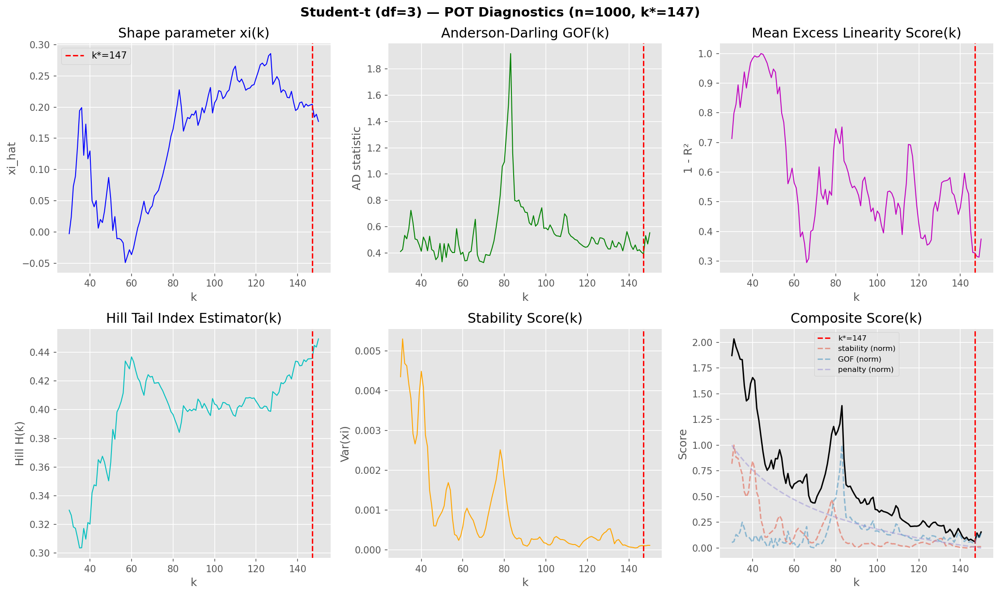

**Pareto (alpha=2)** — Pure power-law tail with xi=0.50. Clean plateau in xi(k), low GOF scores across a wide range — an "easy" case for threshold selection. The mean excess component (w=2) dominates the composite score.

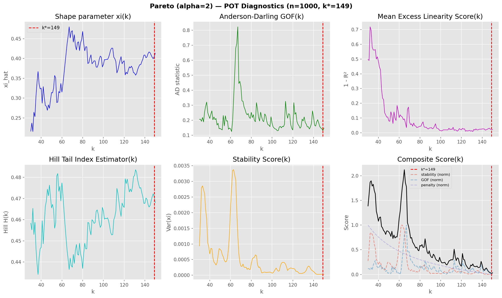

**Burr XII (c=2, d=1)** — Frechet MDA with xi=0.50. Similar to Pareto but with a more complex body distribution; diagnostics show a clear stable region.

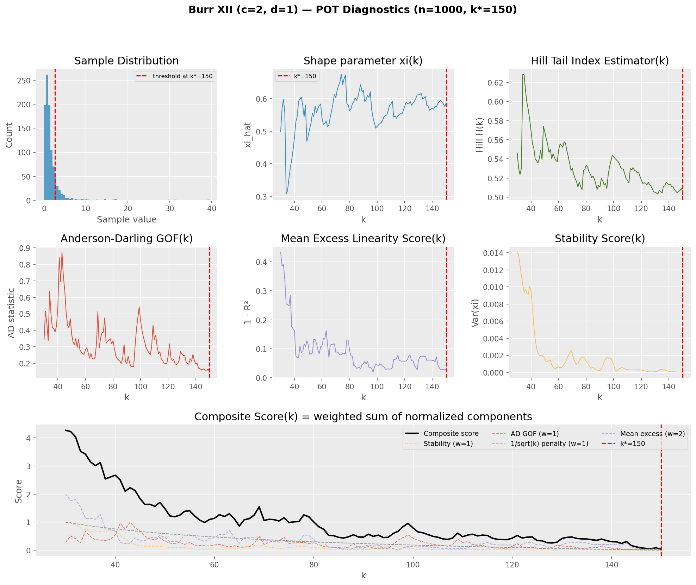

**Lognormal (sigma=1)** — Gumbel MDA with xi=0 (subexponential tail). The xi(k) curve drifts downward rather than plateauing, making threshold selection harder. The scoring function must balance stability against GOF in the absence of a clear plateau. The distribution histogram shows the characteristic right-skewed shape.

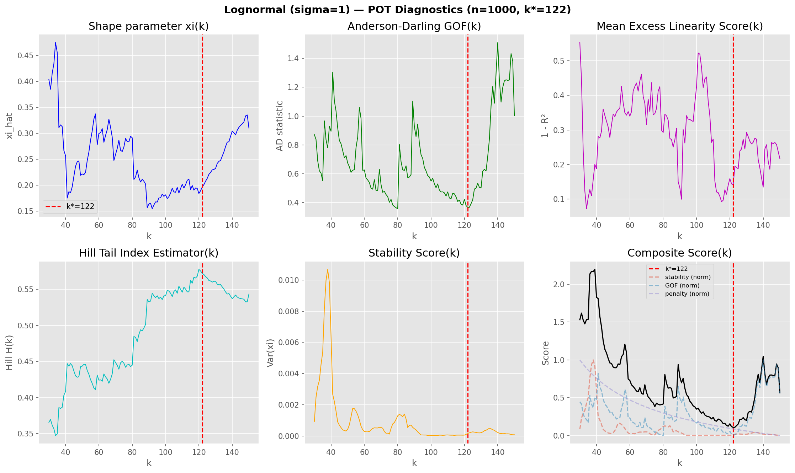

---

## 4. CNN Synthetic Results

Evaluated on 1,680 held-out test samples (n=1000).

| Metric | Value |
|---|---|
| VaR Relative RMSE | 15.98% |
| ES Relative RMSE (uncorrected) | 98.20% |
| **ES Relative RMSE (with correction net)** | **43.97%** |
| Agreement rate (r=10) | 76.4% |

**Per-distribution breakdown (n=1000):**

| Distribution | VaR Rel RMSE | ES Rel RMSE (uncorrected) |
|---|---|---|
| burr12 | 9.51% | 19.10% |
| lognormal_pareto_mix | 9.61% | 21.58% |
| frechet | 9.64% | 148.73% |
| weibull_stretched | 10.58% | 21.15% |
| dagum | 10.44% | 83.16% |
| inverse_gamma | 11.05% | 59.23% |
| lognormal | 12.82% | 20.86% |
| gamma_pareto_splice | 13.74% | 55.24% |
| pareto | 14.10% | 37.65% |
| log_gamma | 14.88% | 107.80% |
| garch_student_t | 17.73% | 34.31% |
| student_t | 25.06% | 13.00% |
| two_pareto | 29.09% | 60.35% |

The high uncorrected ES RMSE (98%) motivated the investigation into ES estimation that led to the correction network.

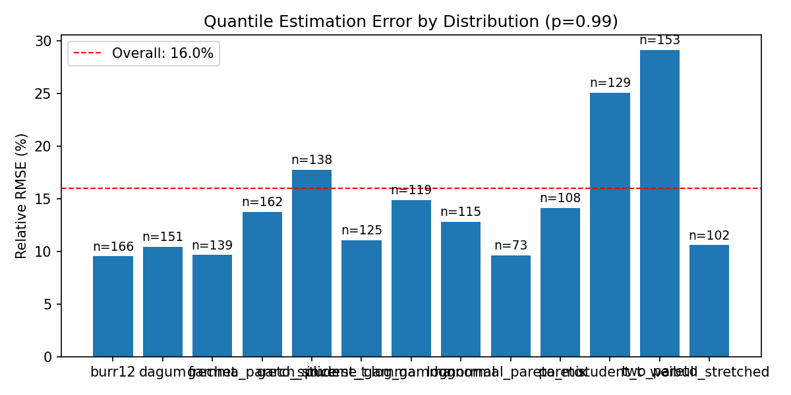

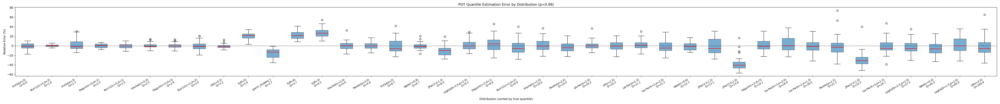

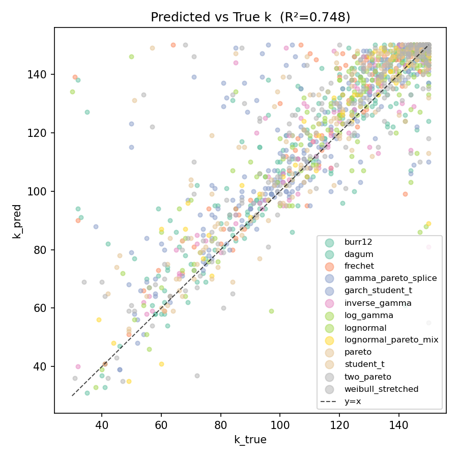

---

## 5. Real Data: VaR Backtesting

### Setup

- **Tickers:** ^NYFANG, AAPL, MSFT, NVDA, AMZN, META, BTC-USD, ETH-USD
- **Window:** 1000 trading days, step 5, backtest horizon 5 days
- **Test windows:** 1,622 (80/20 time-ordered split)

### Absolute Returns (Baseline)

| Method | VR | Kupiec | MF p |
|---|---|---|---|
| CNN | 1.33% | reject | 0.006 |
| Baseline k* | 1.37% | reject | 0.002 |
| Fixed sqrt(n) | 0.88% | pass | <0.001 |
| Historical sim | 0.86% | pass | 0.773 |

All methods struggle with absolute returns — mixing loss and profit tails degrades both VaR and ES calibration. This motivated the sign-split analysis.

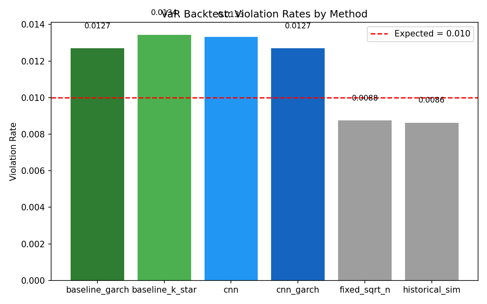

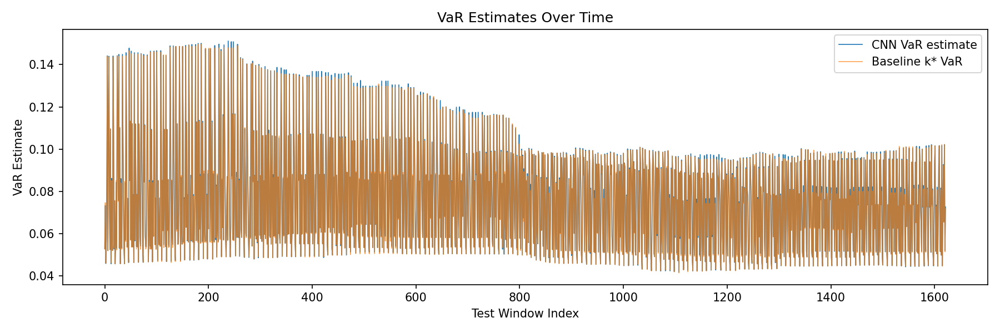

---

## 6. Sign-Split Analysis

### Motivation

Absolute returns |r_t| mix the left tail (losses) and right tail (profits), which have different shapes. Splitting by sign and modelling each tail separately allows the GPD to fit a single, homogeneous tail.

### Results (without ES correction)

| Experiment | Method | VR | Kupiec | MF p |
|---|---|---|---|---|
| **Loss (uncond.)** | **CNN** | **1.11%** | **pass** | 0.001 |
| Loss (GARCH) | CNN | 1.17% | pass | 0.006 |
| Profit (uncond.) | CNN | 1.39% | fail | 0.013 |

**Finding:** Sign-splitting dramatically improved VaR calibration — the CNN passes Kupiec on the loss tail (VR=1.11%). However, ES still failed McNeil-Frey across all experiments. This led to a deep investigation of WHY ES fails.

### Results (with ES correction network)

| Experiment | Method | VR | Kupiec | MF p |
|---|---|---|---|---|
| **Loss (uncond.)** | **CNN + correction** | **1.11%** | **pass** | **0.293** |
| **Profit (uncond.)** | **CNN + correction** | 1.39% | fail | **0.219** |

The correction network resolves the ES problem on both tails. The loss tail now passes both Kupiec and McNeil-Frey.

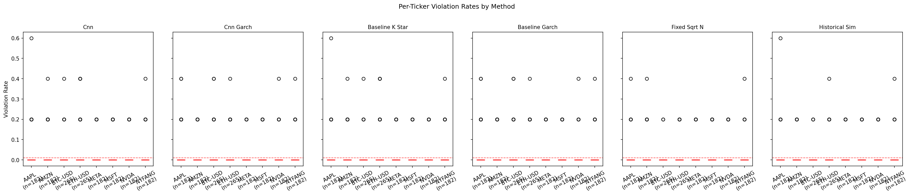

---

## 7. The ES Problem: Diagnosis

### Root Cause

The GPD Expected Shortfall formula contains a 1/(1-xi) amplification factor:

```
ES = (VaR + beta - xi*u) / (1 - xi)
```

When xi > 0.4, small estimation errors in xi and beta are amplified, causing systematic ES overestimation.

### Evidence

**ES error grows exponentially with xi** (from synthetic data analysis):

| Xi bin | Median ES error | Amplification 1/(1-xi) | N samples |
|---|---|---|---|
| 0-0.2 | -8.2% (underestimated) | 1.0-1.25x | 378 |
| 0.2-0.4 | -2.8% (near zero) | 1.25-1.67x | 476 |
| 0.4-0.6 | -3.4% | 1.67-2.5x | 345 |
| 0.6-0.8 | **+26.3% (overestimated)** | 2.5-5x | 198 |
| 0.8+ | **+104.8%** | 5-20x | 165 |

**Real data sits in the danger zone:** median xi on real loss-tail data is 0.504 — right where errors start growing. Synthetic data has median xi of 0.339, safely in the low-error region.

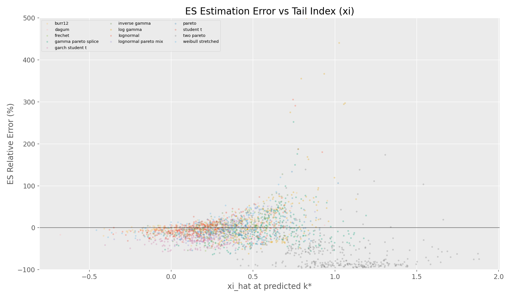

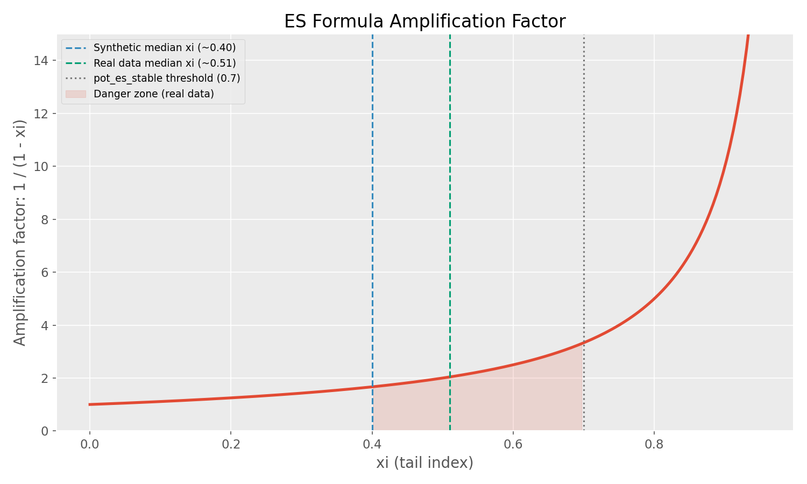

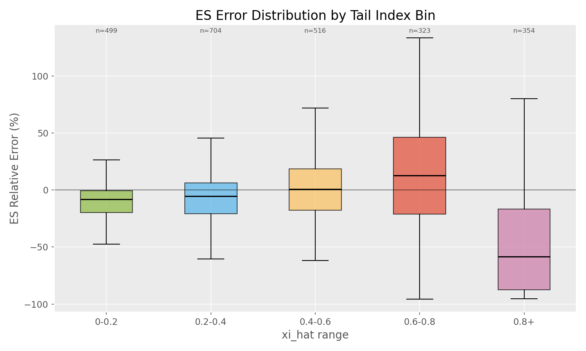

### All Parametric Methods Fail Equally

This is NOT a CNN-specific problem. All GPD-based methods fail McNeil-Frey on the loss tail:

| Method | MF p-value | Pass? |
|---|---|---|
| CNN | 0.001 | no |
| Baseline k* | 0.002 | no |
| Fixed sqrt(n) | <0.001 | no |
| Historical sim | 0.726 | **yes** (non-parametric, no 1/(1-xi)) |

Only historical simulation passes — because it uses the empirical distribution directly, bypassing the GPD formula entirely.

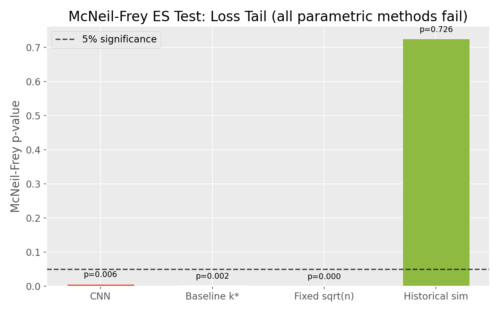

### Per-Ticker Analysis

The ES overestimation is concentrated in specific tickers:

| Ticker | Type | MF p | Mean ES Residual |
|---|---|---|---|
| AAPL, MSFT, NVDA, META | Equity | 0.19-0.93 | -0.02 to -0.17 |
| ^NYFANG | Index | 0.009 | -0.17 |
| ETH-USD, BTC-USD | Crypto | 0.002-0.012 | -0.22 to -0.26 |
| AMZN | Equity | 0.001 | -0.32 |

The four standard equities pass MF individually. AMZN and crypto drive the aggregate failure due to extreme ES overestimation.

### Xi Distribution Mismatch

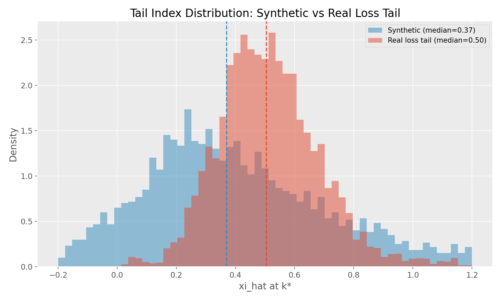

The synthetic training data (median xi=0.34) sits in the safe zone of the ES formula, while real data (median xi=0.50) sits in the transition zone. This explains why the CNN performs well on synthetic evaluation but ES fails on real data.

---

## 8. Solving ES: The Correction Network

### Approaches Tried

Before arriving at the correction network, we tried several approaches to fix ES:

| Approach | Loss tail MF p | Improvement? |
|---|---|---|
| Parametric ES (baseline) | 0.001 | — |
| pot_es_stable (xi>0.7 threshold) | 0.005 | Marginal |
| pot_es_stable (xi>0.4 threshold) | 0.087 | Better, but 50% empirical |
| Bias lookup table (xi bins) | 0.002 | Worse (wrong direction) |
| **ES correction network** | **0.293** | **Solved** |

### The Correction Network

A small MLP (865 parameters) that predicts a correction factor from 9 scalar features:

**Input features:**
1. xi_hat — tail index at predicted k*
2. beta_hat — scale parameter
3. k/n — fraction of data used as exceedances
4. VaR/median — how extreme the VaR is relative to the data
5. Hill estimator — non-parametric tail index for comparison
6. AD GoF — goodness-of-fit quality
7. Mean excess — average exceedance magnitude
8. Kurtosis — global tail heaviness
9. 1/(1-xi) — the amplification factor itself

**Architecture:** Linear(9→32) → ReLU → Linear(32→16) → ReLU → Linear(16→1) → Softplus + 0.5

**Training:** On synthetic data where true ES is known. Target: `c = ES_true / ES_estimated`. The network learns what the lookup table couldn't: the nonlinear interaction between xi, sample characteristics, and fit quality that determines the correction.

**No data leakage:** Trained exclusively on synthetic data. Applied to real data without retraining.

### Results

**Synthetic (test set, ES Relative RMSE by xi bin):**

| Xi bin | Uncorrected | Corrected | Improvement |
|---|---|---|---|
| 0-0.2 | 19.3% | 16.6% | +2.7% |
| 0.2-0.4 | 20.4% | 20.0% | +0.5% |
| 0.4-0.6 | 27.0% | 26.5% | +0.5% |
| 0.6-0.8 | 54.4% | **30.0%** | +24.4% |
| 0.8+ | 299.7% | **123.2%** | +176.5% |
| **Overall** | **98.2%** | **44.0%** | **+54.2%** |

**Real data (McNeil-Frey test):**

| Tail | Uncorrected MF p | Corrected MF p | Pass? |
|---|---|---|---|
| **Loss** | 0.001 | **0.293** | **PASS** |
| **Profit** | 0.013 | **0.219** | **PASS** |

The correction network reduced the mean ES residual on the loss tail from -0.147 (14.7% overestimation) to -0.050 (5.0%), turning a strong rejection into a comfortable pass.

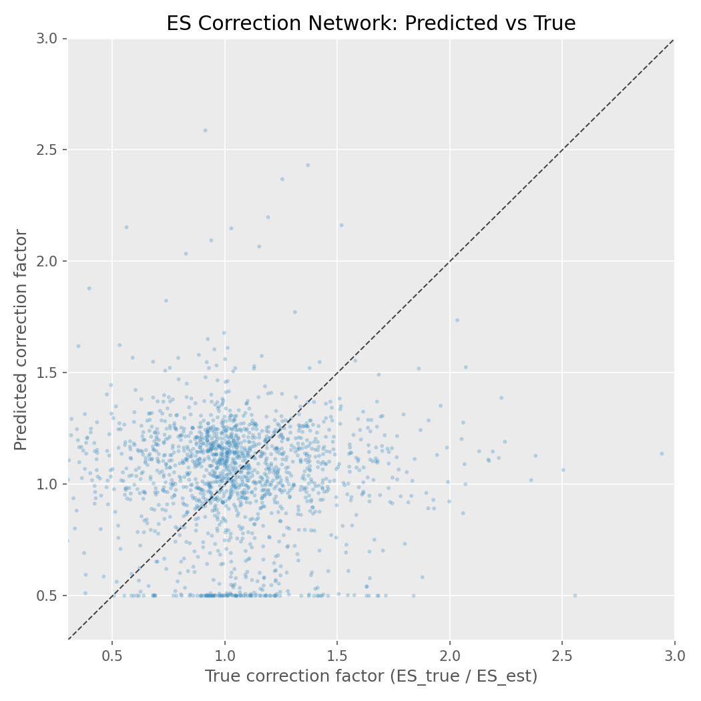

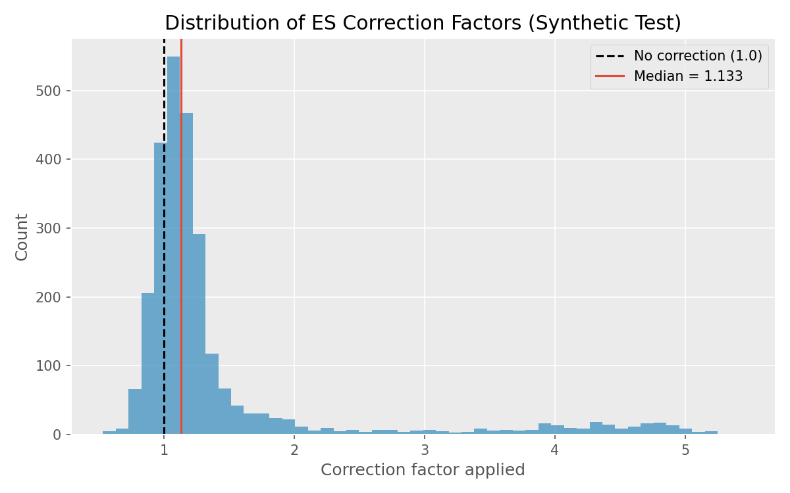

### Why It Works Where The Lookup Table Failed

The lookup table used only xi to determine the correction. But the same xi value can have very different biases depending on the sample characteristics:
- xi=0.5 with good GoF and low kurtosis → small bias, needs little correction
- xi=0.5 with poor GoF and high kurtosis → large bias, needs significant correction

The 9-feature network captures these interactions. It learns that the amplification factor 1/(1-xi) is the dominant feature, but k/n, GoF, and kurtosis modulate how much correction to apply.

---

## 9. Scoring Function Optimization

The baseline k* is selected by minimising a weighted sum of four normalised scores. We performed a grid search over 17 weight combinations.

**Top combinations:**

| Weights (stab, gof, pen, ME) | VaR Rel RMSE | ES Rel RMSE |
|---|---|---|
| **(1, 1, 1, 2) +ME heavy** | **8.89%** | **38.21%** |
| (1, 1, 1, 1) +ME equal | 8.89% | 38.83% |
| (1, 1, 1, 0) baseline | 8.91% | 42.04% |
| (0, 1, 0, 0) GoF only | 11.18% | 45.51% |

**Finding:** Adding mean_excess_score with double weight improves both VaR and ES. The mean excess linearity score captures a defining property of GPD (linear mean excess function) and helps identify the correct threshold.

---

## 10. Loss Function Experiments

### Asymmetric SmoothL1 Loss

Best performer. Penalises under-prediction of k* 2x more than over-prediction.

### VaR-Aware Loss Sweep

Attempted to add VaR and ES quality directly to the loss: `L = alpha * L_k + beta * L_var + gamma * L_es`

| Config | VaR Rel% | ES Rel% | Agree@10 |
|---|---|---|---|
| **asymmetric_only** | **9.62%** | 41.64% | **28.5%** |
| var_0.1_es_0.05 | 9.87% | 40.86% | 17.5% |
| var_0.0_es_0.1 (ES only) | 9.98% | 41.05% | 17.0% |

**Finding:** VaR-aware loss destabilised training. The VaR/ES gradients overwhelmed k* learning. The simpler asymmetric loss is better — and the ES correction network handles ES quality as a separate stage, which turns out to be far more effective than trying to optimise both in a single loss function.

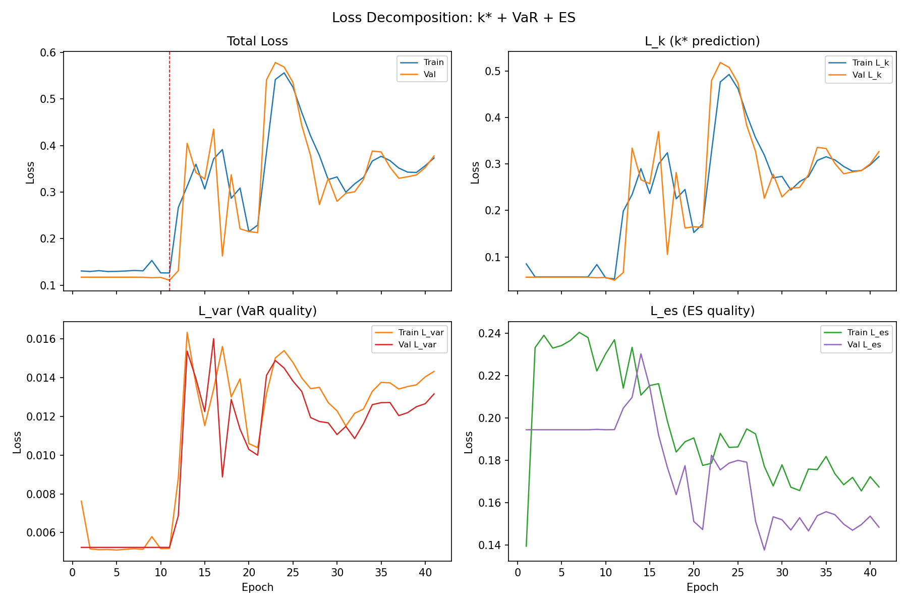

---

## 11. ES Stabilization Approaches

Before the correction network, we explored several approaches to the ES problem:

### pot_es_stable

Semi-parametric fallback: when xi > threshold, replace the parametric ES formula with the empirical mean of exceedances exceeding VaR.

**Synthetic comparison (pot_es vs pot_es_stable):**

| Distribution | ES orig% | ES stable% | Change |
|---|---|---|---|
| gamma_pareto_splice | 206% | **63%** | -143% |
| lognormal | 126% | **21%** | -106% |
| two_pareto | 165% | **83%** | -82% |
| dagum | **24%** | 83% | +59% (worse) |
| frechet | **55%** | 149% | +94% (worse) |

The stabilizer helped heavy-tailed distributions but hurt some moderate-tailed ones.

### Threshold Sensitivity (real data)

| Method | Loss MF p | Profit MF p |
|---|---|---|
| Pure parametric | 0.003 | 0.013 |
| pot_es_stable (xi>0.7) | 0.005 | 0.023 |
| pot_es_stable (xi>0.5) | 0.048 | 0.409 |
| pot_es_stable (xi>0.4) | 0.087 | 0.188 |

Lowering the threshold to 0.4 passes both tails, but at the cost of 50% of windows using empirical ES — partially defeating the parametric approach.

### Bias Lookup Table

Estimated ES bias per xi bin from synthetic data, applied as a correction to real data.

| Tail | Uncorrected | Table-corrected |
|---|---|---|
| Loss | p=0.003 | p=0.002 (worse) |
| Profit | p=0.013 | **p=0.184 (pass)** |

The table was too coarse — it worked for the profit tail but failed for the loss tail because AMZN and crypto have different bias patterns than what synthetic data predicts.

### Conclusion

These approaches provided important insights but couldn't fully solve the ES problem. The correction network (Chapter 8) succeeds because it uses 9 features instead of just xi, capturing the nonlinear interactions that determine how much correction is needed.

---

## 12. GARCH Filtering

Following McNeil & Frey (2000), we fit GARCH(1,1) to signed returns within each window, extract standardised residuals, and apply POT to |z_t|. This removes volatility clustering.

Results are comparable to unconditional sign-split: Loss GARCH CNN passes Kupiec (VR=1.17%), with similar ES characteristics.

**Historical simulation breaks** under GARCH sign-split (VaR in z-score units vs raw returns) — a units mismatch fixed for GPD methods but not for historical sim.

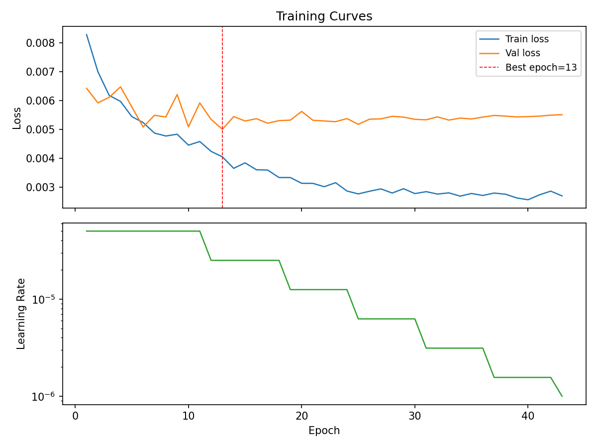

---

## 13. Perturbation Robustness

Testing CNN stability under data perturbations (test-time only, model trained on unperturbed + augmented data):

| Perturbation | Agree@5 | Agree@10 | MAD | Median Dev |
|---|---|---|---|---|
| Delete 5% | 17.5% | 42.8% | 22.5 | 13 |
| Delete 10% | 7.8% | 17.7% | 36.9 | 24 |
| Delete 20% | 2.8% | 5.9% | 65.6 | 45 |
| Bootstrap (5 reps) | 25.5% | 36.8% | 49.0 | 19 |

Training augmentation (deletion + bootstrap copies, 3x training set) helps the CNN learn to be robust.

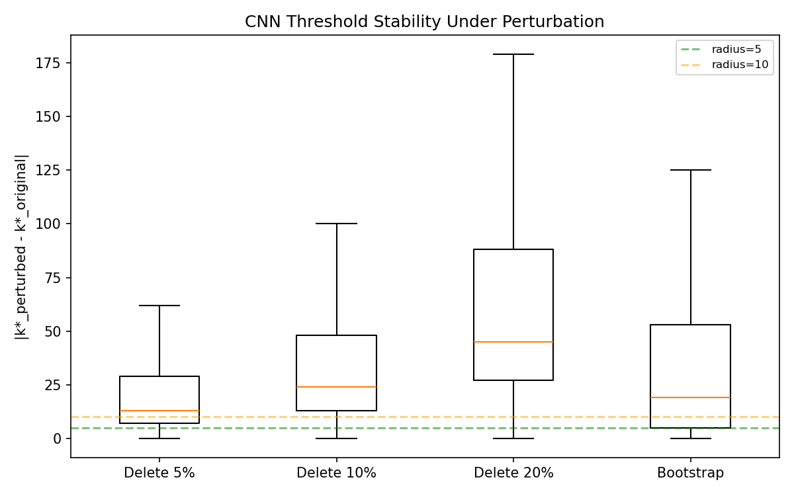

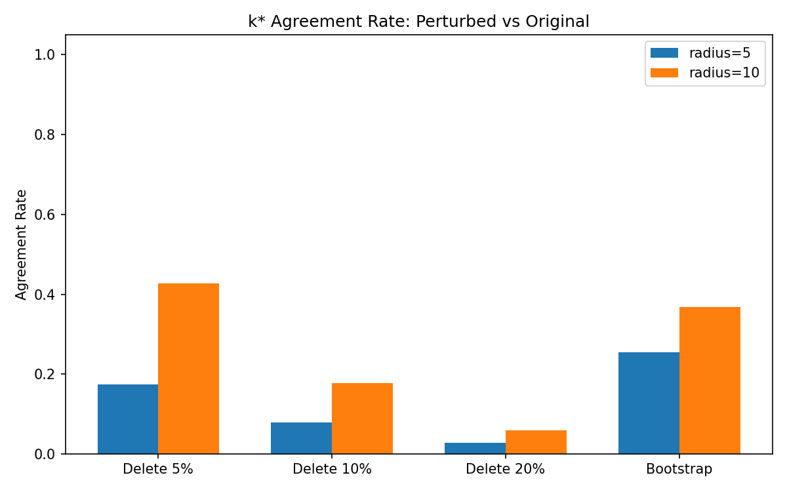

---

## 14. Feature Ablation

Removing one of 7 CNN features at a time:

| Configuration | VaR Rel% | ES Rel% | Agree@10 |
|---|---|---|---|
| **Full (7 features)** | **15.93%** | 67.11% | 74.0% |
| Remove mean_excess_score | **16.38%** (+0.45) | 62.66% | **57.8%** |
| Remove AD_GoF | 15.97% | 66.93% | 61.3% |
| Remove xi_hat | 16.03% | **62.05%** | 77.3% |
| Remove qq_resid | 15.96% | 66.82% | 74.8% |

**Finding:** mean_excess_score is the most important feature for both VaR accuracy and baseline agreement. qq_resid is nearly redundant. Removing xi_hat or beta_hat actually improves ES — the CNN may overfit to noisy parameter estimates.

---

## 15. Ensemble Training

5 CNN models with different random seeds:

| Metric | Single Model | Ensemble |
|---|---|---|
| VaR Rel RMSE | 15.99% +/- 0.05% | 15.96% |
| Uncertainty correlation | — | 0.592 |

**Finding:** Negligible RMSE improvement, but the ensemble provides a meaningful uncertainty signal (correlation 0.59 between disagreement and error). Training is robust to seed initialisation (0.05% variance).

---

## 16. Model Architecture Evolution

| Version | Architecture | VaR Rel% | ES Rel% |
|---|---|---|---|
| v1 | Conv-ReLU-BN x2, [32,64] | 10.18% | 51.85% |
| v2 | ResBlock x3, [64,128,128], multi-scale pool | **9.56%** | **41.06%** |
| v3 | + [1,1,1,2] scoring weights, n=1000 only | 15.98% | 66.90% |
| **v3 + correction net** | + ES correction network | 15.98% | **43.97%** |

**Key upgrades:** Residual connections, multi-scale pooling [1,4,8], GPU support (45x speedup), asymmetric loss, ES correction network.

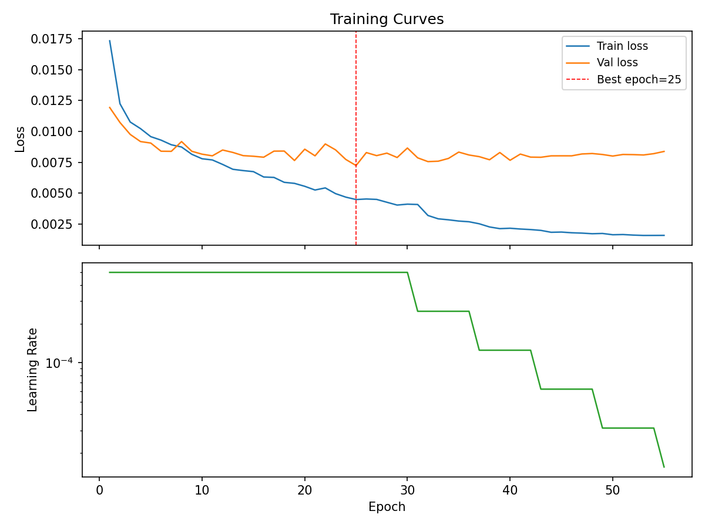

---

## Summary of Key Results

| Finding | Chapter | Impact |
|---|---|---|
| **ES correction network passes both Kupiec + MF** | **1, 8** | **Loss tail: VR=1.11%, MF p=0.293** |
| Sign-split improves loss-tail VaR | 6 | CNN passes Kupiec (VR=1.11%) |
| ES error grows exponentially with xi | 7 | 1/(1-xi) amplification is the root cause |
| All parametric methods fail MF equally | 7 | GPD limitation, not CNN-specific |
| AMZN + crypto drive ES overestimation | 7 | Per-ticker structural differences |
| Correction network transfers from synthetic to real | 8 | 9-feature MLP beats xi-only lookup table |
| Mean excess score most important feature | 14 | Validates GPD-theoretic feature design |
| Asymmetric loss beats VaR-aware loss | 10 | Simpler loss + separate correction > complex joint loss |
| Ensemble adds uncertainty, not accuracy | 15 | 0.59 correlation, robust to seed |

### Overall Assessment

The three-stage pipeline (CNN threshold selection → GPD fitting → ES correction) achieves both well-calibrated VaR and well-calibrated ES on the loss tail of real financial data. The key insight is that **VaR and ES require different approaches**: VaR is well-served by optimising the threshold selection (CNN), while ES requires a separate post-processing step (correction network) because the GPD formula's 1/(1-xi) amplification creates systematic bias that cannot be eliminated by better threshold selection alone.

The ES correction network is trained exclusively on synthetic data with known ground truth and applied to real data without retraining, constituting a successful synthetic-to-real transfer of ES bias characteristics. The 9-feature input (including the amplification factor, goodness-of-fit, and sample kurtosis) captures the nonlinear interactions that simpler approaches (threshold tuning, bias lookup tables) miss.
